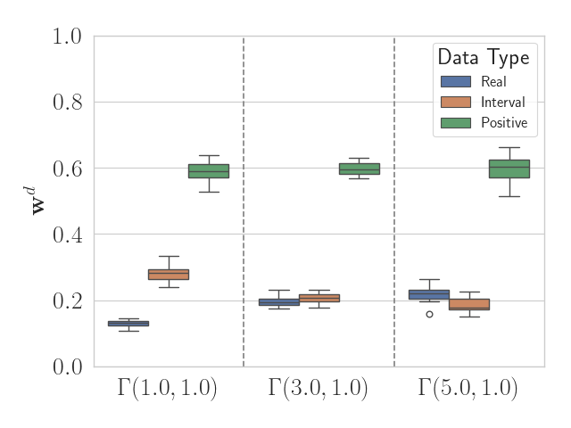

# Discovering the Statistical Data Types of Variables with Probabilistic Matrix Factorization and Variational Autoencoders

This repo contains the code for running all the experiments from my Bachelor
thesis "Discovering the Statistical Data Types of Variables with Probabilistic
Matrix Factorization and Variational Autoencoders". It is not intended to be
used as a library but may serve as inspiration for similar projects.

## Installation

To install the required packages for both algorithms, run the following command:

```bash
conda env create -f environment.yml
```

## Usage

All the experiments can be run using the `sdtd` module. For this, it is necessary to be in the root directory of the project and to activate the conda environment:

```bash
conda activate sdtd
```

## Probabilistic Matrix Factorization

Part of my Bachelor thesis involved reproducing the experiments from this publication:

> I. Valera and Z. Ghahramani, 
> "Automatic Discovery of the Statistical Types of Variables in a Dataset", 
> 34th International Conference on Machine Learning (ICML 2017). Sydney (Australia), 2017.

The code for this is located in the `sdtd.gibbs` module. It implements the Gibbs sampling algorithm
for the probabilistic graphical model:

<p align="center">

</p>

The results, datasets and commands to reproduce the
experiments are as follows:

### Real-valued data

<p align="center">


</p>

```bash
python -m sdtd.gibbs.hydra_main dataset=real K=1 dataset.loc=0 dataset.scale=10
python -m sdtd.gibbs.hydra_main dataset=real K=1 dataset.loc=10 dataset.scale=10
python -m sdtd.gibbs.hydra_main dataset=real K=1 dataset.loc=10 dataset.scale=100
```

### Positive real-valued data

<p align="center">



</p>

```bash
python -m sdtd.gibbs.hydra_main dataset=positive K=1 dataset.a=1.0 dataset.scale=1.0
python -m sdtd.gibbs.hydra_main dataset=positive K=1 dataset.a=3.0 dataset.scale=1.0
python -m sdtd.gibbs.hydra_main dataset=positive K=1 dataset.a=5.0 dataset.scale=1.0
```

### Interval-valued data

<p align="center">


</p>

```bash
python -m sdtd.gibbs.hydra_main dataset=interval K=1 dataset.a=0.5 dataset.b=0.5
python -m sdtd.gibbs.hydra_main dataset=interval K=1 dataset.a=0.5 dataset.b=1.0
python -m sdtd.gibbs.hydra_main dataset=interval K=1 dataset.a=0.5 dataset.b=3.0
```

### Categorical data

<p align="center">

</p>
<p align="center">


</p>

```bash
python -m sdtd.gibbs.hydra_main -m dataset=categorical K=1,2,3,4,5 dataset.n_classes=3,4,5,6,7,8,9
```

### Ordinal data

<p align="center">

</p>
<p align="center">


</p>

```bash
python -m sdtd.gibbs.hydra_main -m dataset=ordinal K=1,2,3,4,5 dataset.n_classes=3,4,5,6,7,8,9
```

### Count data

<p align="center">

</p>
<p align="center">


</p>

```bash
python -m sdtd.gibbs.hydra_main -m dataset=count K=1,2,3,4,5 dataset.a=2,3,4,5,6,7,8
```

For the real-world datasets, the number of simulations must explicitly be set to 1,
since the default is 10. They can be run with following commands:

### German Credit Dataset

```bash
python -m sdtd.gibbs.hydra_main dataset=german K=10 n_simulations=1
```
### Adult Dataset

```bash
python -m sdtd.gibbs.hydra_main dataset=adult K=10 n_simulations=1
```

## Variational Autoencoder
This part of the project is located in the `sdtd.vae` module. It implements the probabilistic graphical model

<p align="center">

</p>

It takes advantage of `lightning`
to run the experiments and log the results in a structured way.
As a result, however, they need to be run in a two-step process. First, the sweep needs to be
initialized with a configuration file specifying the hyperparameters:

```bash
wandb sweep --project vae <path-to-config-file>
```

This will output a `sweep-id` that can then be used to start the sweep:

```bash
wandb agent <sweep-id>
```

This process can be used to run all the experiments specified in the
`sdtd/vae/configs/sweeps` directories. The outputs for each of the experiments
will be logged in the `wandb` project `vae` and can be found in the `Sweeps`
tab.
